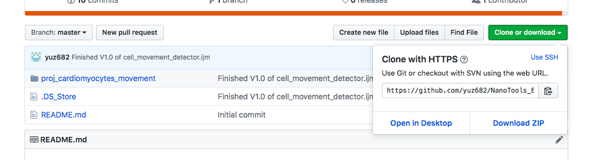
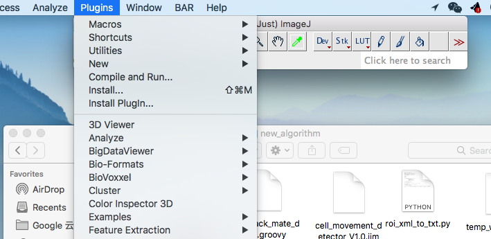
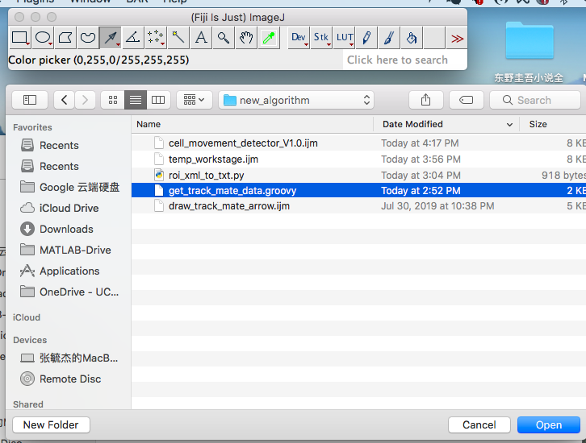
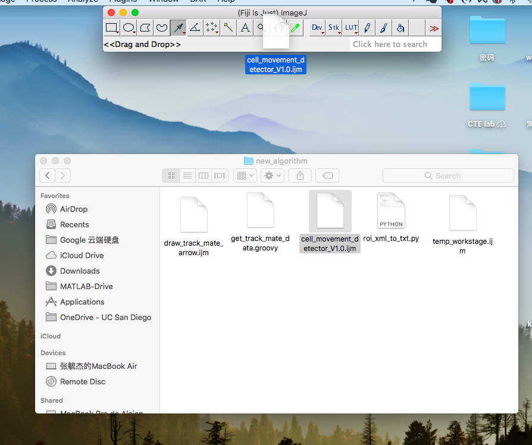
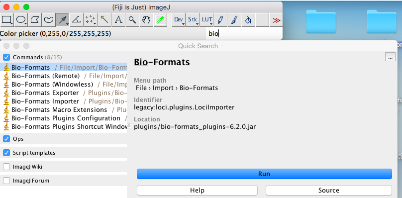
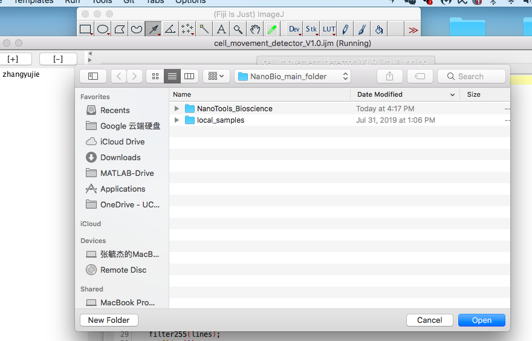
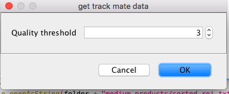
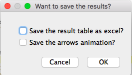

# Cell Movement Detector

- This program is designed to detect and quantify the movements of cardiomyocytes in microscope videos. You need to have ImageJ and Fiji downloaded on your computer to use this program. 

## Setup

### git clone the Github repository 

### Install the plugins

- Go to Fiji -> Plugins -> Install Plugin... 

- Go to local Github repository and select proj_cardiomyocytes_movement -> new_algorithm -> get_track_mate_data.groovy. Press OK to popup windows. Do the same procedures to proj_cardiomyocytes_movement -> new_algorithm -> roi_xml_to_txt.py by repeating Install the plugins procedure. 

### Open the main script and your own video

- Go to the local Gihub repository (proj_cardiomyocytes_movement -> new_algorithm) then drag and drop the cell_movement_detector_V1.0.ijm to Fiji.

- Use Bio-Format to open your video by typing it in the search bar.

### Run the program

- Run the main script cell_movement_detector_V1.0.ijm (command + r in Mac). Select the directory you want to save the results. 

- Set the threshold for detecting cells. Set the minimum number of slides the ROI has to last to be considered in the output. 

![workflow]

- Check the satisfaction box if you want to continue or keep setting new threshold untill you are satisfied. Let the program do the work. Ignore any exception popup windows if the program is not aborted. 

- Save the data as excel and the arrow animations by checking the boxes. You can still see the result table an the arrows animation window if you leave them blank. 

## Citation

Tinevez, JY.; Perry, N. & Schindelin, J. et al. (2016), "TrackMate: An open and extensible platform for single-particle tracking.", Methods 115: 80-90, PMID 27713081 (on Google Scholar).

